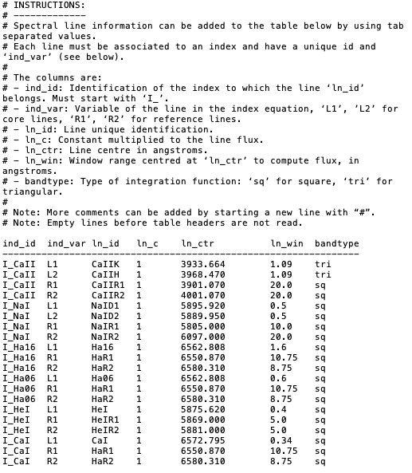
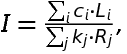

# ACTIN 1.3.9

### Activity Indices Calculator

[](https://doi.org/10.21105/joss.00667)
[](https://doi.org/10.5281/zenodo.1478610)


Reads fits files from HARPS, HARPS-N and ESPRESSO spectrographs, rdb tables, and outputs user defined spectral activity indices (along with other relevant data).


*This version is no longer being maintained - please use [ACTIN2](https://github.com/gomesdasilva/ACTIN2) instead.*


### Requires the following Python modules:
- numpy
- matplotlib
- astropy


### Installation:

Clone the github repository to a directory of your choice and install via `python setup.py install`.


### Configuration file:

The `config_lines.txt` file is the line configuration file (instructions inside). This file is used to add line parameters to calculate any index as long as the line cores and bandpasses are inside the spectral range and spectral orders range (for 2d spectra) of the spectrograph. ACTIN will check this at start and give an error message if line parameters don't match the spectra.

Example of a `config_lines.txt` file:




Any index `ind_id` is calculated using the formula:



where Li and Rj are the fluxes in the `ind_var` main and reference lines, as indicated in the config file. ci and kj are the `ln_c` constants multiplied to each main and reference lines, respectively.

The description of the flux calculation is available in the Appendix A of [Gomes da Silva et al. 2021](https://ui.adsabs.harvard.edu/abs/2020arXiv201210199G/abstract).

`I_CaII` is the classical S-index [Duncan et al. 1991](https://ui.adsabs.harvard.edu/abs/1991ApJS...76..383D/abstract) (not calibrated to the Mt. Wilson scale).

`I_Ha16` and `I_Ha06` are Halpha indices with 1.6 and 0.6 ang central bandpasses, respectively.

`I_CaI` is an activity insensitive line.

The line parameters for `I_NaI`, `I_Ha16`, and `I_HeI` come from [Gomes da Silva et al. 2011](https://ui.adsabs.harvard.edu/abs/2011A%26A...534A..30G/abstract).


The config file is available from the directory each OS uses for storing user data (*)

To get your path to the config file call `actin` without any arguments.

The file can be copied to another directory, modified, and then used by adding `-cf dir/filename` when running `actin`.


### Quick start:

Usage:

```
actin -h [help] -f [files_list] -i [indices_list] -rv [rv_list] -cf [config_file] -s [output_path] -lp [output_path/same/show] -obj [object_name] -tl [target_list] -del [True/False] -t [test_file_type] -frc [True/False] -sp [True/False]
```


Arguments:

`-h` : Gives a description of the arguments available.

`-f` : List of files (formats S1D, S2D, e2ds, s1d, s1d_*_rv, or ADP) or rdb table(s) with headers `obj`, `date`, `bjd`, `wave`, `flux`, `error_pixel` (optional) to be read.

`-i` : List of indices to calculate. Indices ids must match the ones in the config file `config_lines.txt`.

`-rv` : List of RV values to calibrate wavelength. If not used, RVs are used from CCF files if available.

`-cf` : Path to configuration file. If not given the configuration file is read from installation directory To know installation directory call `actin` without arguments.

`-s` : Save output to .rdb table in specified path.

`-lp` : Save plots of the lines used to calculate the indices in the specified path. If `same` uses the path as specified in `-s` If `show` shows the plots without saving, useful to analyse the lines in one spectra.

`-tl` : List of stars to select from `files`.

`-del` : If `True` deletes any output file (data and logs only; only files that match current ACTIN call will be deleted) before reading the file list and saving output.

`-obj` : Object name to override the one from fits files in case the star has multiple names in different files (ex. Proxima, ProximaCen, Gl551). BE CAREFUL WHEN READING FILES FROM MULTIPLE STARS.

`-t` : Tests the program using the test files. Options are `S2D`, `S1D`, `e2ds`, `s1d`, `adp` or `rdb` to test these type of files.

`-frc` : Use fractional pixels if `True` (default), use integral pixels if `False`. If using `False` and calculating the I_CaII index as given in the original config_lines.txt file ACTIN will simulate the values of 's_raw' from the HARPS pipeline. Note however that this option might induce artificial variations in the indices due to the use of integral pixels in the bandpasses.

`-sp` : If True saves time-series and multi-plots to same directory as `-s`.

#### Important:

When running ACTIN for a second time with the same data on the same output directory use `-del True` otherwise the program will detect the same dates,  ignore the measurements and not give any output.

When arguments accept lists, they can be given in the command line, e.g. `-tl Gl273 Gl581`, or from an ASCII file by using, e.g. `-tl $(cat target_list.txt)` where `target_list.txt` is a file with one column with the rows `Gl273` and `Gl581`.

### Testing the code with minimum arguments:

The example below will test the code using the test files provided in the package.

```
actin -t e2ds
```

Can also use the options `s1d`, `S1D`, `S2D`, `ADP`, and `rdb` to test on other file types.

### Example for multiple files:

```
actin -f ../fits/*/*e2ds_A.fits -i I_CaII I_Ha -s ../output -del True -tl Gl273 Gl581
```

This will execute ACTIN for all the subdirectories inside `../fits/` with files ending with `e2ds_A.fits`, calculate the indices `I_CaII` and `I_Ha`, output the data to `../output/star_names`, and, before running the code, delete any output file that was previously there, in this case `Gl273_HARPS_e2ds_data.rdb` and `Gl581_HARPS_e2ds_data.rdb`. Only fits files belonging to the stars chosen in `-tl` will be read, in this case `Gl273` and `Gl581`. Since `-frc` is True by default, fractional pixels will be used to compute the indices.


### Using ACTIN as a python module:

To use ACTIN as a module use `import actin.actin as actin` and then call the function:

```
actin.actin(files, calc_index=None, rv_in=None, config_file=None, save_output=False, ln_plts=False, obj_name=None, targ_list=None, del_out=False, frac=True, test=False, save_plots=False)
```

The arguments are the same as the ones described above (with just a slight different name in some cases).

Note that some arguments need to be given as lists when they accept lists, e.g. `calc_index` should be `calc_index=['I_CaII']` even when using only one index.

### Output rdb table:

The output rdb file has headers with data from the fits headers of the files (data headers) and data calculated by ACTIN (index headers).

#### Data headers:

Some of these headers might not be available if CCF files are not provided.

`obj` : Object targeted

`instr` : Instrument used

`obs_date` : Observation date

`bjd` : Barycentric Julian Date [days]

`rv` : Radial Velocity [m/s]

`rv_err` : Error of `rv` [m/s]

`fwhm` : Fullwidth-at-Half-Maximum of CCF profile [m/s]

`fwhm_err` : Error of `fwhm` [m/s]

`cont` : Contrast of CCF profile [%]

`cont_err` : Error of `cont` [%]

`bis` : Bisector inverse span of the CCF profile [m/s]

`bis_err` : Error of `bis` [m/s]

`ccf_noise` : CCF noise [m/s]

`median_snr` : Median signal-to-noise of spectrum

`data_flg` : Flag indicating if spectrum was not deblazed as ´noDeblazed´

`bv` : B-V colour

`airmass` : Airmass

`exptime` : Exposure time

#### Index headers:

These headers depend on the choices of indices to calculate.

`<ind_id>` is the identification of the index as in the configuration file.

`<ln_id>` is the identification of the line as in the configuration file.

`I_<ind_id>` : Value of the index <index_id>

`I_<ind_id>_err` : Error of index

`I_<ind_id>_snr` : Median signal-to-noise ratio of the orders used to calculate the index

`I_<ind_id>_flg` : Flag with value `negFlux` if negative values of flux found in the bandpasses of the index

`I_<ind_id>_mfracneg` : Maximum fraction of pixels with negative flux found in the bandpasses of the index

`<ln_id>_npixels` : Number of pixels (fractionary) inside the bandpass associated with the line <ind_ln>.

---

(*)
For OSX: `~/Library/Application Support/<AppName>`

For Windows: `C:\Documents and Settings\<User>\Application Data\Local Settings\<AppAuthor>\<AppName>` or possibly `C:\Documents and Settings\<User>\Application Data\<AppAuthor>\<AppName>`

For Linux: `~/.local/share/<AppName>`

---

### Citing

If you use ACTIN in your research, please cite

Gomes da Silva, J. et al. JOSS 3, 667G (2018) (DOI: 10.21105/joss.00667)

or use the ready-made BibTex entry

```
@ARTICLE{2018JOSS....3..667G,
       author = {{Gomes da Silva}, Jo{\~a}o and {Figueira}, Pedro and {Santos}, Nuno and
         {Faria}, Jo{\~a}o},
        title = "{ACTIN: A tool to calculate stellar activity indices}",
      journal = {The Journal of Open Source Software},
     keywords = {Astrophysics - Instrumentation and Methods for Astrophysics, Astrophysics - Solar and Stellar Astrophysics},
         year = "2018",
        month = "Nov",
       volume = {3},
       number = {31},
        pages = {667},
          doi = {10.21105/joss.00667},
archivePrefix = {arXiv},
       eprint = {1811.11172},
 primaryClass = {astro-ph.IM},
       adsurl = {https://ui.adsabs.harvard.edu/abs/2018JOSS....3..667G},
      adsnote = {Provided by the SAO/NASA Astrophysics Data System}
}
```

### Published papers using ACTIN
https://ui.adsabs.harvard.edu/abs/2018JOSS....3..667G/citations

---

For issues, bugs or if you would like to contribute to the development of this code contact Joao.Silva(at)astro.up.pt
